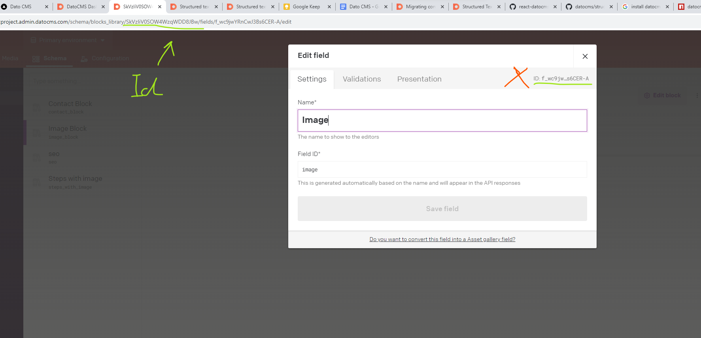

This is a [Next.js](https://nextjs.org/) project bootstrapped with [`create-next-app`](https://github.com/vercel/next.js/tree/canary/packages/create-next-app).

## Getting Started

First, run the development server:

```bash
npm run dev
# or
yarn dev
# or
pnpm dev
# or
bun dev
```

Open [http://localhost:3000](http://localhost:3000) with your browser to see the result.

You can start editing the page by modifying `app/page.tsx`. The page auto-updates as you edit the file.

This project uses [`next/font`](https://nextjs.org/docs/basic-features/font-optimization) to automatically optimize and load Inter, a custom Google Font.

# DATO CMS

## cma-client-node

### EXAMPLES

Look at: **lib/datocmsimporttest.js**

### CREATE MIGRATION

```bash
$ npx datocms migrations:new 'create article model' --api-token=<YOUR-API-TOKEN>


```

### RUN MIGRATIONS

For migrations we should use this documentation https://www.datocms.com/docs/content-management-api

```bash
$ npx datocms migrations:run --api-token=<YOUR-API-TOKEN>
# or
$ npx datocms migrations:run --destination=feature-environment --api-token=<YOUR-API-TOKEN>
# or
$ npx datocms migrations:run --source=feature-environment --in-place --api-token=<YOUR-API-TOKEN>
```

### ADD NEW FIELD WITH BLOCK

If you add new field with block, you should use right ID from url not from popup window


